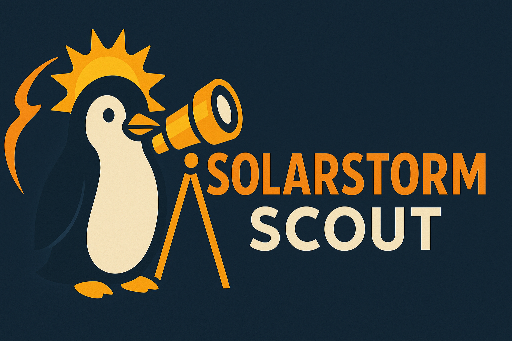

# 🌞 SolarStorm Scout

<div align="center">
  
</div>

**Space Weather Social Media Bot** - Automated HF propagation updates for Bluesky and Mastodon

SolarStorm Scout fetches real-time space weather data from NOAA and posts threaded updates about:
- HF Propagation Conditions
- D-Region Absorption Predictions
- Aurora Forecasts
- GOES Solar X-Ray Flux

Perfect for amateur radio operators, space weather enthusiasts, and anyone interested in HF propagation!

> **⚠️ Note**: Space weather conditions can change rapidly. Data represents conditions at post time. For real-time updates, visit [NOAA Space Weather Prediction Center](https://www.swpc.noaa.gov/).

## 🎯 Features

- ✅ **Dual Platform Support**: Post to Bluesky and/or Mastodon
- ✅ **Thread Support**: Posts 5-part threads with detailed information
- ✅ **300 Character Limit**: Each post optimized for readability
- ✅ **Configurable Interval**: Default 1.5 hours, fully customizable
- ✅ **Multiple Deployment Options**: systemd timer, Docker, or manual
- ✅ **Secrets Management**: Support for .env files and Doppler
- ✅ **Real-time NOAA Data**: Direct from Space Weather Prediction Center
- ✅ **Professional Formatting**: Clean, informative posts with hashtags

## 📋 Thread Format

Each update consists of 5 posts:

**Post 1**: Solar Indices
- Solar Flux Index (SFI)
- A-index & K-index
- Critical frequency (foF2)
- Maximum Usable Frequency (MUF)
- D-Layer absorption percentage
- NOAA Scales (R/S/G)

**Post 2**: Band Conditions
- 160m through 6m band-by-band conditions
- Quality indicators with emojis (🟢 Good, 🟡 Fair, 🔴 Closed)
- Best bands for current conditions
- MUF reference

**Post 3**: D-Region Absorption (with D-RAP map image)
- Current absorption status
- Time-based context (day/night)
- Band recommendations for conditions

**Post 4**: Aurora Forecast (with aurora oval image)
- Aurora power level
- K-index
- Visibility predictions
- VHF propagation notes

**Post 5**: GOES X-Ray Flux (with generated chart)
- Current X-ray classification
- 6-hour trend chart
- Solar flare impact assessment
- Radio blackout warnings

## 🚀 Quick Start

### Prerequisites

- Python 3.11 or higher (3.10 not supported due to numpy requirements)
- Active Bluesky and/or Mastodon account
- Linux system with systemd (for systemd installation)
- Docker (for Docker installation)

### Option 1: systemd Installation (Recommended for Linux servers)

1. **Clone the repository:**
   ```bash
   git clone https://github.com/ChiefGyk3D/solarstorm_scout.git
   cd solarstorm_scout
   ```

2. **Create configuration:**
   ```bash
   cp .env.example .env
   nano .env  # Edit with your credentials
   ```

3. **Run installer:**
   ```bash
   chmod +x scripts/install-solarstorm.sh
   ./scripts/install-solarstorm.sh
   ```

4. **Follow prompts to:**
   - Set posting interval (default: 1.5 hours)
   - Choose Python environment (venv recommended)
   - Optionally run a test post

### Option 2: Docker Installation

1. **Pull from GitHub Container Registry:**
   ```bash
   docker pull ghcr.io/chiefgyk3d/solarstorm_scout:latest
   ```

2. **Create configuration:**
   ```bash
   cp .env.example .env
   nano .env  # Edit with your credentials
   ```

3. **Run container:**
   ```bash
   docker run --rm --env-file=.env ghcr.io/chiefgyk3d/solarstorm_scout:latest
   ```

4. **Or build locally:**
   ```bash
   git clone https://github.com/ChiefGyk3D/solarstorm_scout.git
   cd solarstorm_scout
   docker build -t solarstorm_scout .
   docker run --rm --env-file=.env solarstorm_scout
   ```

5. **Schedule with cron:**
   ```bash
   crontab -e
   # Add: Run every 1.5 hours
   0 */1 * * * docker run --rm --env-file=/path/to/.env ghcr.io/chiefgyk3d/solarstorm_scout:latest
   30 */2 * * * docker run --rm --env-file=/path/to/.env ghcr.io/chiefgyk3d/solarstorm_scout:latest
   ```

### Option 3: Manual Installation

1. **Install dependencies:**
   ```bash
   pip install -r requirements.txt
   ```

2. **Configure:**
   ```bash
   cp .env.example .env
   nano .env
   ```

3. **Run manually:**
   ```bash
   python3 -m solarstorm_scout.main
   ```

## 🔧 Configuration

### Social Media Setup

#### Bluesky
1. Go to [Bluesky App Passwords](https://bsky.app/settings/app-passwords)
2. Create new app password: "SolarStorm Scout"
3. Copy password to `.env` file:
   ```env
   BLUESKY_ENABLED=true
   BLUESKY_HANDLE=yourhandle.bsky.social
   BLUESKY_APP_PASSWORD=your-app-password
   ```

#### Mastodon
1. Log into your Mastodon instance
2. Go to Preferences → Development → New Application
3. Name: "SolarStorm Scout"
4. **Required Scopes**:
   - ✅ `read` - Verify account credentials
   - ✅ `write:statuses` - Post status updates and threads
   - ✅ `write:media` - Upload images to posts
5. Click "Submit" to create the application
6. Copy access token to `.env`:
   ```env
   MASTODON_ENABLED=true
   MASTODON_API_BASE_URL=https://your-instance.social
   MASTODON_ACCESS_TOKEN=your-access-token
   ```

### Doppler Secrets Manager (Optional)

Instead of `.env` files, use Doppler:

1. Create [Doppler](https://doppler.com) account
2. Create project and add secrets
3. Generate service token
4. Set in environment:
   ```env
   DOPPLER_TOKEN=your-service-token
   ```

## 🕐 Scheduling

### systemd Timer (Linux)

Automatically configured by `install-solarstorm.sh` script.

**View status:**
```bash
sudo systemctl status solarstorm-scout.timer
```

**View logs:**
```bash
sudo journalctl -u solarstorm-scout.service -f
```

**Manual run:**
```bash
sudo systemctl start solarstorm-scout.service
```

**Change interval:**
Edit `/etc/systemd/system/solarstorm-scout.timer` and change `OnUnitActiveSec=` value, then:
```bash
sudo systemctl daemon-reload
sudo systemctl restart solarstorm-scout.timer
```

### System Cron

For Docker or manual runs:

```bash
crontab -e
```

Add:
```cron
# Every 1.5 hours (at :00 and :30 past odd hours)
0 1-23/2 * * * cd /path/to/solarstorm-scout && python3 -m solarstorm_scout.main
30 0-22/2 * * * cd /path/to/solarstorm-scout && python3 -m solarstorm_scout.main

# Or with Docker
0 1-23/2 * * * docker run --rm --env-file=/path/to/.env ghcr.io/chiefgyk3d/solarstorm_scout:latest
30 0-22/2 * * * docker run --rm --env-file=/path/to/.env ghcr.io/chiefgyk3d/solarstorm_scout:latest
```

## 📊 Data Sources

All data fetched from [NOAA Space Weather Prediction Center](https://www.swpc.noaa.gov/):

- **Solar Flux Index**: 10.7cm radio emissions (F10.7)
- **Planetary K-index**: Geomagnetic activity
- **Aurora Power**: Hemispheric power index
- **GOES X-Ray Flux**: Real-time solar X-ray monitoring

Data updated every run (default: 1.5 hours).

## 🛠️ Development

### Project Structure

```
solarstorm_scout/
├── solarstorm_scout/
│   ├── __init__.py
│   ├── main.py          # Main bot orchestrator
│   ├── config.py        # Configuration & secrets
│   ├── spaceweather.py  # NOAA data fetcher
│   ├── formatter.py     # Message formatter
│   ├── social.py        # Social media posters
│   ├── chart_renderer.py # GOES X-ray chart generator
│   └── demo.py          # Preview tool
├── scripts/
│   ├── install-solarstorm.sh
│   ├── create-secrets.sh
│   ├── install-systemd.sh
│   └── uninstall-systemd.sh
├── media/
│   ├── banner.png       # README banner
│   ├── logo.png         # Project logo
│   └── streamelements.png # Donation image
├── .github/
│   └── workflows/       # CI/CD pipelines
├── .env.example
├── requirements.txt
├── Dockerfile
├── LICENSE
└── README.md
```

### Running Tests

```bash
# Install dev dependencies
pip install -e ".[dev]"

# Run tests
pytest

# Format code
black solarstorm_scout/

# Lint
flake8 solarstorm_scout/
```

## 🔍 Troubleshooting

### Bot not posting

1. **Check service status:**
   ```bash
   sudo systemctl status solarstorm-scout.timer
   sudo systemctl status solarstorm-scout.service
   ```

2. **View logs:**
   ```bash
   sudo journalctl -u solarstorm-scout.service -n 50
   ```

3. **Test manually:**
   ```bash
   cd /path/to/solarstorm-scout
   source venv/bin/activate  # if using venv
   python3 -m solarstorm_scout.main
   ```

### Authentication errors

- **Bluesky**: Verify app password (not account password)
- **Mastodon**: Check access token and API base URL
- **Permissions**: Ensure scopes include `read` and `write`

### NOAA data fetch errors

- Check internet connectivity
- NOAA APIs occasionally timeout - bot will retry on next run
- View detailed logs: `LOG_LEVEL=DEBUG` in `.env`

### Docker issues

```bash
# Pull latest image
docker pull ghcr.io/chiefgyk3d/solarstorm_scout:latest

# Test container manually
docker run --rm --env-file=.env ghcr.io/chiefgyk3d/solarstorm_scout:latest

# Build locally if needed
docker build --no-cache -t solarstorm_scout .
docker run --rm --env-file=.env solarstorm_scout
```

## 📝 License

Mozilla Public License 2.0 (MPL-2.0)

**Commercial Use Requirements:**
- ✅ You MAY use this software commercially
- ✅ You MAY modify this software for commercial purposes
- ⚠️ You MUST share any modifications to MPL-licensed files under the same MPL 2.0 license
- ⚠️ Modified versions must clearly indicate changes were made
- ✅ You can combine with proprietary software (file-level copyleft, not project-level)

**In Summary:** If you modify any of the Python files in `solarstorm_scout/`, you must contribute those changes back under MPL 2.0. Your larger project can remain proprietary, but the modified bot code must be open source.

See [LICENSE](LICENSE) file for complete details.

## 🤝 Contributing

Contributions welcome! Please:

1. Fork the repository
2. Create a feature branch
3. Make your changes
4. Add tests if applicable
5. Submit a pull request

## 📧 Support

- **Issues**: [GitHub Issues](https://github.com/ChiefGyk3D/solarstorm_scout/issues)
- **Discussions**: [GitHub Discussions](https://github.com/ChiefGyk3D/solarstorm_scout/discussions)

## 🙏 Acknowledgments

- **NOAA Space Weather Prediction Center** - For excellent public APIs
- **Amateur Radio Community** - For inspiration and support
- **Bluesky & Mastodon** - For open social media platforms

## 📖 Related Projects

- [Penguin Overlord](https://github.com/chiefgyk3d/penguin-overlord) - Discord bot with HAM radio features
- [NOAA Space Weather](https://www.swpc.noaa.gov/) - Official NOAA space weather site

---

## 💝 Donations and Tips

If you find SolarStorm Scout useful, consider supporting development:

**Donate**:

<div align="center">
  <table>
    <tr>
      <td align="center"><a href="https://patreon.com/chiefgyk3d?utm_medium=unknown&utm_source=join_link&utm_campaign=creatorshare_creator&utm_content=copyLink" title="Patreon"></a></td>
      <td align="center"><a href="https://streamelements.com/chiefgyk3d/tip" title="StreamElements"></a></td>
    </tr>
    <tr>
      <td align="center">Patreon</td>
      <td align="center">StreamElements</td>
    </tr>
  </table>
</div>

### Cryptocurrency Tips

<div align="center">
  <table style="border:none;">
    <tr>
      <td align="center" style="padding:8px; min-width:120px;">
        
      </td>
      <td align="left" style="padding:8px;">
        <b>Bitcoin</b><br/>
        <code style="font-size:12px;">bc1qztdzcy2wyavj2tsuandu4p0tcklzttvdnzalla</code>
      </td>
    </tr>
    <tr>
      <td align="center" style="padding:8px; min-width:120px;">
        
      </td>
      <td align="left" style="padding:8px;">
        <b>Monero</b><br/>
        <code style="font-size:12px;">84Y34QubRwQYK2HNviezeH9r6aRcPvgWmKtDkN3EwiuVbp6sNLhm9ffRgs6BA9X1n9jY7wEN16ZEpiEngZbecXseUrW8SeQ</code>
      </td>
    </tr>
    <tr>
      <td align="center" style="padding:8px; min-width:120px;">
        
      </td>
      <td align="left" style="padding:8px;">
        <b>Ethereum</b><br/>
        <code style="font-size:12px;">0x554f18cfB684889c3A60219BDBE7b050C39335ED</code>
      </td>
    </tr>
  </table>
</div>

---

<div align="center">

Made with ❤️ by [ChiefGyk3D](https://github.com/ChiefGyk3D)

## Author & Socials

<table>
  <tr>
    <td align="center"><a href="https://social.chiefgyk3d.com/@chiefgyk3d" title="Mastodon"></a></td>
    <td align="center"><a href="https://bsky.app/profile/chiefgyk3d.com" title="Bluesky"></a></td>
    <td align="center"><a href="http://twitch.tv/chiefgyk3d" title="Twitch"></a></td>
    <td align="center"><a href="https://www.youtube.com/channel/UCvFY4KyqVBuYd7JAl3NRyiQ" title="YouTube"></a></td>
    <td align="center"><a href="https://kick.com/chiefgyk3d" title="Kick"></a></td>
    <td align="center"><a href="https://www.tiktok.com/@chiefgyk3d" title="TikTok"></a></td>
    <td align="center"><a href="https://discord.chiefgyk3d.com" title="Discord"></a></td>
    <td align="center"><a href="https://matrix-invite.chiefgyk3d.com" title="Matrix"></a></td>
  </tr>
  <tr>
    <td align="center">Mastodon</td>
    <td align="center">Bluesky</td>
    <td align="center">Twitch</td>
    <td align="center">YouTube</td>
    <td align="center">Kick</td>
    <td align="center">TikTok</td>
    <td align="center">Discord</td>
    <td align="center">Matrix</td>
  </tr>
</table>

</div>

---

**73 de SolarStorm Scout!** 📡🌞

*Keep your HF bands alive and propagation thriving!*
